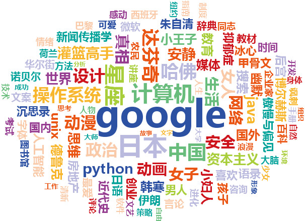

--------------------------
title: 人人网关键词
date: 2012-01-14
summary: 我的人人网关键词。
folder: life
tags: keywords, sns
---------------------

通过人人关键词这个应用，分析我在人人网上最近状态的内容，提取出关键词。这个应用基本上可以反映出我的兴趣爱好。

根据算法原理，这些关键词中会出现某些我并未提及的词语，比如这两个

1.  博尔赫斯:豪尔赫·路易斯·博尔赫斯(Jorge Luis
    Borges，1899－1986)，阿根廷作家。

2.  德鲁克:彼得·费迪南·德鲁克(Peter Ferdinand
    Drucker，1909－2005)，现代管理之父，“大师中的大师”。

看来我应该阅读一下博尔赫斯的作品，也许会一见如故。
